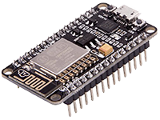
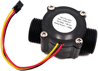
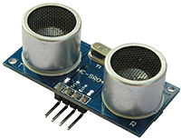

# Aqua Monitor 💧

Aqua Monitor is a comprehensive web application dedicated to monitoring and managing water usage efficiently.

## Overview 🌐

Aqua Monitor integrates a microcontroller-based system to measure water consumption, providing users with insightful data on their usage patterns. The platform enables users to review their historical water consumption, set personal limits, and receive timely notifications. Administrators have the added capability to monitor and regulate water usage for enhanced control.

## Problem Statement ❌

The unregulated use of water, coupled with instances of excess consumption and undetected leaks, poses environmental and economic challenges. Aqua Monitor aims to address these issues by promoting responsible water usage.

### Goal 🎯
The primary goal of Aqua Monitor is to monitor water usage effectively, thereby discouraging excessive consumption and contributing to environmental conservation.

## Getting Started 🚀

### Requirements

#### Hardware:

- NodeMCU ESP8266 
  
  

- Waterflow Sensor
  
  

- Ultrasonic Sensor
  
  

Please install the necessary tools listed below to run this if you are not using Docker

- Arduino IDE
- NodeJS
- MySQL
- InfluxDB

### Configure
Read [this](https://vvijayk1999.github.io) detailed article to setup and configure Aqua Monitor System.

## Contributing 🤝
We welcome contributions from the community to make Aqua Monitor even better. Whether you're a developer, designer, tester, or simply an enthusiast, your input is valuable!

### How to Contribute 🛠️
1. **Fork the Repository:** Start by forking the Aqua Monitor repository to your GitHub account.
2. **Clone the Repository:** Clone the forked repository to your local machine using the following command:
    ```shell
    git clone https://github.com/vvijayk1999/aqua-monitor.git
    ```
3. **Create a Branch:** Create a new branch for your contribution.
    ```shell
    git checkout -b feature/your-feature
    ```
4. **Make Changes and Test:** Implement and test your changes locally to ensure they work as intended.
5. **Commit Changes and Push:** Commit your changes with a clear and descriptive commit message and push the commits to your Github repository.
    ```shell
    git commit -m "add your-feature or fix your-bug"
    git push origin feature/your-feature
    ```
6. **Create a Pull Request:** Open a pull request from your forked repository to the main Aqua Monitor repository. Be sure to provide a detailed description of your changes.
___
**Thank you for contributing to Aqua Monitor!** 🌊💙